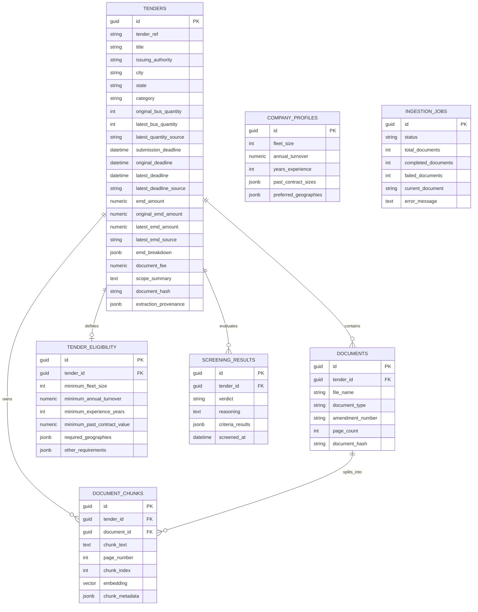
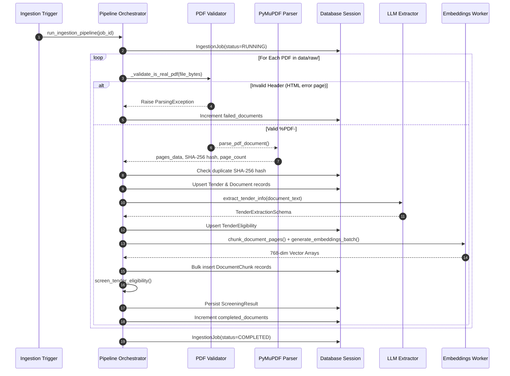
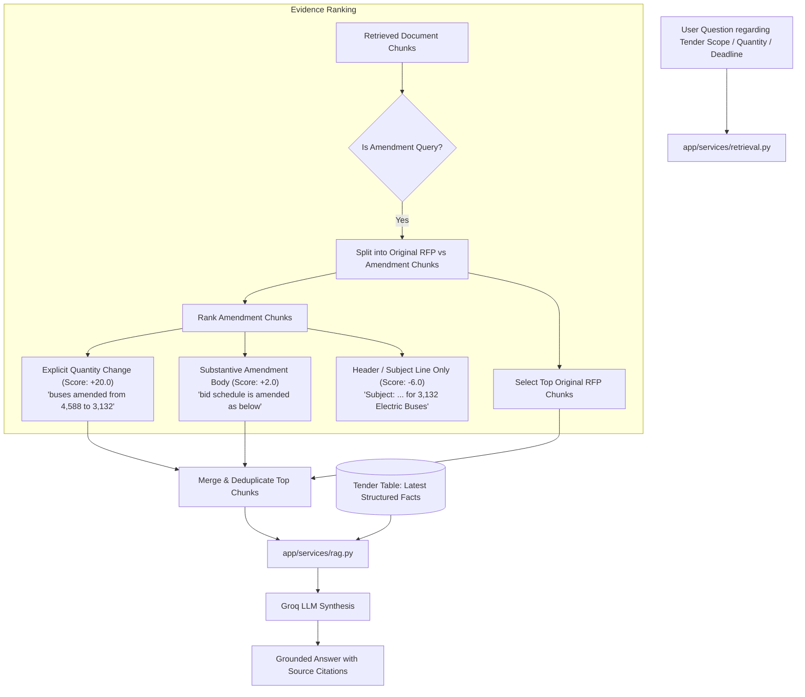
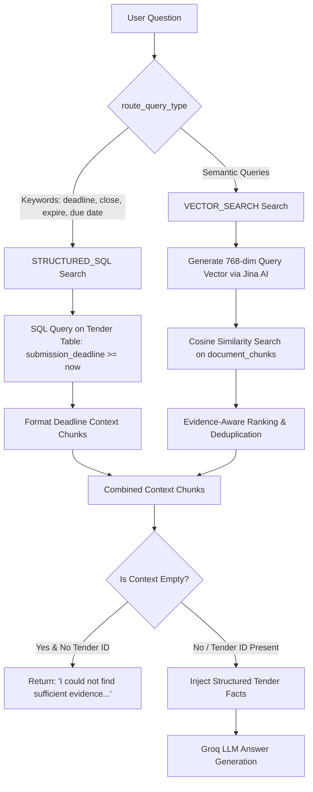
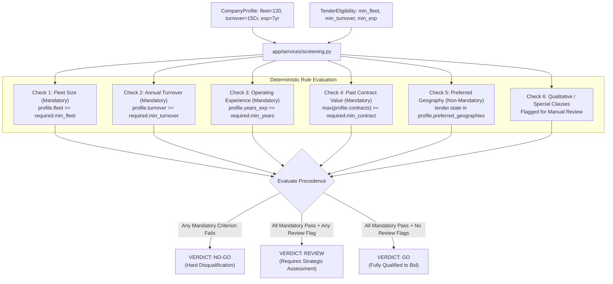
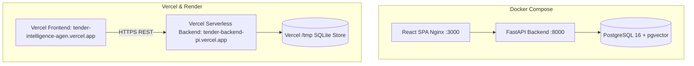

# Tender Intelligence Agent — System Design Document

---

## 1. Overview

The **Tender Intelligence Agent** is an end-to-end AI-powered procurement intelligence platform designed specifically for public sector Bus Operations and Electric Vehicle (EV) Gross Cost Contract (GCC) tenders in India. 

Public bus procurement tenders issued by nodal agencies—such as **Convergence Energy Services Limited (CESL)**, the **Ministry of Housing and Urban Affairs (MoHUA)**, and State Transport Undertakings (STUs)—are massive, highly technical legal documents spanning hundreds of pages with numerous corrigenda and addenda.

The Tender Intelligence Agent automates the entire procurement workflow:
1. **Document Ingestion & Validation:** Validates authentic PDF binary streams, extracts page-level text, computes cryptographic fingerprints, and maintains complete document lineage.
2. **Structured Information Extraction:** Parses complex tender terms into normalized parameters (INR currency values, minimum fleet sizes, operating experience, multi-lot EMD breakdowns, and submission deadlines).
3. **Deterministic Screening Engine:** Evaluates company profile capabilities against tender criteria using pure deterministic logic ($NO\text{-}GO > REVIEW > GO$).
4. **Amendment-Aware Retrieval & Grounded RAG:** Ingests corrigenda chronologically, ranks substantive amendment clauses over header-only notices, injects authoritative structured facts, and synthesizes answers strictly grounded in source texts with page-accurate citations.
5. **REST API & Interactive Workspace:** Provides a FastAPI REST interface and a React SPA workspace for tender screening, profile management, and interactive Q&A.

---

## 2. Assignment Requirements and Compliance Matrix

| # | Assignment Requirement | Implementation in Codebase | Status | Evidence in Codebase |
|---|---|---|---|---|
| **1** | **Tender Ingestion:** Ingest $\ge 10$ tender PDFs from government portals | 17 verified, authentic PDF documents in `data/raw/` covering 4 major national bus programs | **IMPLEMENTED** | `data/raw/*.pdf`, `scripts/validate_seed_docs.py`, `backend/tests/test_seed_data_integrity.py` |
| **2** | **Integrity Guardrail:** Guard against non-PDF scraper artifacts | Magic-byte `%PDF-` verification in `_validate_is_real_pdf()` before parser ingestion | **IMPLEMENTED** | `backend/app/services/pdf_parser.py:12-25`, `backend/tests/test_seed_data_integrity.py` |
| **3** | **Structured Fact Extraction:** Extract key parameters (dates, EMD, fleet size, turnover, experience) | Pydantic extraction schema with heuristic fallback; lot-wise EMD JSONB structure | **IMPLEMENTED** | `backend/app/services/extraction.py`, `backend/app/schemas/extraction.py`, `backend/app/db/models.py:80-145` |
| **4** | **Amendment Tracking:** Resolve original vs amended quantities, deadlines, and EMDs | Multi-field resolution (`original_*`, `latest_*`, `latest_*_source`) and amendment ranking | **IMPLEMENTED** | `backend/app/db/models.py:90-111`, `backend/app/agent/pipeline.py:42-170`, `backend/app/services/retrieval.py:270-420` |
| **5** | **Deterministic Screening:** Evaluate company profile against tender criteria ($NO\text{-}GO > REVIEW > GO$) | Pure Python threshold evaluator; strict verdict precedence with mandatory failure enforcement | **IMPLEMENTED** | `backend/app/services/screening.py:10-160`, `backend/tests/test_screening.py` |
| **6** | **Grounded RAG Pipeline:** Question answering with strict provenance citations | Hybrid query router (SQL + pgvector), prompt template enforcement, and provenance citation payload | **IMPLEMENTED** | `backend/app/services/rag.py`, `backend/app/services/retrieval.py`, `backend/app/prompts/rag_system.txt` |
| **7** | **Zero-Hallucination Fallback:** Return honest message when evidence is missing | Refuses to fabricate answers when vector context and structured tender records are empty | **IMPLEMENTED** | `backend/app/services/rag.py:62-75`, `backend/tests/test_rag_pipeline.py` |
| **8** | **Vector Embeddings (768-dim):** Matryoshka 768-dim embeddings with fail-fast validation | Jina AI (`jina-embeddings-v5-omni-small`), LiteLLM Gemini, local SentenceTransformer; dimension safeguard | **IMPLEMENTED** | `backend/app/services/embeddings.py`, `backend/tests/test_embedding_migration.py`, `backend/tests/test_chunking.py` |
| **9** | **Cost & Token Tracking:** Monitor LLM latency, token usage, and dynamic pricing | Token calculation with provider-specific pricing; structured agent logging | **IMPLEMENTED** | `backend/app/llm/client.py:80-130`, `backend/tests/test_api.py:30-55` |
| **10** | **Concurrent Ingestion Guard:** Reject overlapping ingestion runs | Active `IngestionJob` status check raising HTTP 409 Conflict | **IMPLEMENTED** | `backend/app/api/ingestion.py:23-28`, `backend/tests/test_api.py:60-75` |
| **11** | **MCP Server Integration:** Model Context Protocol discovery tool | FastMCP server exposing tender screening and search tools | **IMPLEMENTED** | `backend/app/api/mcp_server.py` |
| **12** | **Authentication & RBAC:** User roles and secure access control | Not implemented; API endpoints are open and public | **NOT IMPLEMENTED** | Documented in Section 17 & 21 |
| **13** | **Live OCR Pipeline:** Automatic Tesseract OCR on scanned image PDFs | PyMuPDF extracts text streams; non-searchable image PDFs flag warning | **PARTIALLY IMPLEMENTED** | `backend/app/services/pdf_parser.py:50-65` |

---

## 3. System Architecture

The system is organized into a modular layered architecture separating presentation, API routing, agent orchestration, service workers, database persistence, and external LLM/Embedding providers.

```mermaid
flowchart TD
    subgraph Client Layer
        UI[React + Vite Frontend SPA]
        MCP_CLIENT[Claude Desktop / MCP Client]
    end

    subgraph API & Routing Layer [FastAPI Application]
        ROUTER_TENDERS[/api/tenders]
        ROUTER_SCREENING[/api/tenders/{id}/screen]
        ROUTER_CHAT[/api/chat]
        ROUTER_PROFILE[/api/profile]
        ROUTER_INGESTION[/api/ingestion/run]
        MCP_SERVER[FastMCP Server]
    end

    subgraph Pipeline Orchestration [Explicit Hand-Rolled Loop]
        ORCH[app/agent/pipeline.py]
        VALIDATOR[PDF Magic-Byte Guard]
        PARSER[PyMuPDF Page Parser]
        EXTRACTOR[LLM Structured Fact Extractor]
        CHUNKER[Semantic Page-Aware Chunker]
        SCREENER[Deterministic Screening Engine]
        RAG_ENGINE[Hybrid Retrieval & RAG Service]
    end

    subgraph Persistence Layer
        DB[(PostgreSQL + pgvector / SQLite Fallback)]
        TABLE_TENDERS[(tenders)]
        TABLE_DOCS[(documents)]
        TABLE_CHUNKS[(document_chunks - 768d)]
        TABLE_ELIG[(tender_eligibility)]
        TABLE_SCREENING[(screening_results)]
        TABLE_PROFILES[(company_profiles)]
        TABLE_JOBS[(ingestion_jobs)]
    end

    subgraph External AI Services
        GROQ[Groq API: gpt-oss-120b / qwen3.6-27b]
        JINA[Jina AI: v5-omni-small 768-dim]
        GEMINI[Gemini API / LiteLLM Cloud]
        LOCAL_ST[Local SentenceTransformer Fallback]
    end

    UI -->|HTTP REST / JSON| API & Routing Layer
    MCP_CLIENT -->|stdio / SSE| MCP_SERVER
    ROUTER_INGESTION -->|BackgroundTasks| ORCH
    ROUTER_CHAT --> RAG_ENGINE
    ROUTER_SCREENING --> SCREENER

    ORCH --> VALIDATOR --> PARSER --> EXTRACTOR --> CHUNKER --> SCREENER
    EXTRACTOR --> GROQ
    CHUNKER --> JINA
    JINA -.->|Fallback| GEMINI -.->|Fallback| LOCAL_ST
    RAG_ENGINE --> GROQ

    ORCH --> TABLE_TENDERS
    ORCH --> TABLE_DOCS
    ORCH --> TABLE_CHUNKS
    ORCH --> TABLE_ELIG
    SCREENER --> TABLE_SCREENING
    RAG_ENGINE --> TABLE_CHUNKS
    RAG_ENGINE --> TABLE_TENDERS
```

---

## 4. Component Architecture

### 4.1 Module Breakdown

| Module Path | Primary Responsibility | Key Functions / Classes |
|---|---|---|
| `backend/app/main.py` | FastAPI application initialization, CORS middleware, global exception handlers, lifespan management. | `lifespan()`, `app` |
| `backend/app/agent/pipeline.py` | Multi-stage pipeline orchestrating document discovery, parsing, hash verification, extraction, chunking, and database seeding. | `run_ingestion_pipeline()`, `seed_data_pipeline()`, `CATALOG` |
| `backend/app/services/pdf_parser.py` | Validates `%PDF-` header bytes, extracts page-by-page text with PyMuPDF, detects non-English text, and computes SHA-256 hashes. | `_validate_is_real_pdf()`, `parse_pdf_document()` |
| `backend/app/services/chunking.py` | Splits document pages into size-bounded chunks while strictly preserving page-number provenance and paragraph boundaries. | `chunk_document_pages()` |
| `backend/app/services/embeddings.py` | Generates 768-dimensional Matryoshka embeddings via Jina AI, cloud LiteLLM, or local SentenceTransformer with strict fail-fast validation. | `generate_embedding()`, `generate_embeddings_batch()`, `_call_jina_api()` |
| `backend/app/services/retrieval.py` | Hybrid retriever routing date/deadline queries to SQL and semantic queries to pgvector cosine search with evidence-aware ranking. | `retrieve_relevant_context()`, `route_query_type()`, `evidence_rank()` |
| `backend/app/services/rag.py` | Formulates grounded system prompts, injects structured tender facts and retrieved chunks, invokes LLM, and formats citations. | `answer_tender_question()` |
| `backend/app/services/screening.py` | Pure deterministic Python screening engine comparing company profiles against extracted numeric requirements. | `screen_tender_eligibility()` |
| `backend/app/services/extraction.py` | Prompts LLM for structured JSON extraction; normalizes currencies (Lakhs, Crores) and metric values; falls back to heuristics. | `extract_tender_info()`, `_normalize_currency_string()` |
| `backend/app/llm/client.py` | LiteLLM abstraction managing primary (Groq `gpt-oss-120b`), fallback (`qwen3.6-27b`), sanitizing `<think>` tokens, and calculating token costs. | `LiteLLMClient`, `llm_client` |
| `backend/app/db/database.py` | Database engine factory attempting PostgreSQL + pgvector connection with automatic SQLite local fallback. | `get_engine()`, `get_db()`, `SessionLocal` |
| `backend/app/db/models.py` | SQLAlchemy ORM entity definitions with cross-database `GUID`, `JSONType`, and `VectorType` decorators. | `Tender`, `Document`, `DocumentChunk`, `TenderEligibility`, `ScreeningResult`, `CompanyProfile`, `IngestionJob` |

---

## 5. Data Model

The database schema captures relational metadata, hierarchical document revisions, extracted eligibility rules, screening evaluations, and high-dimensional vector embeddings.



---

## 6. Tender Document Ingestion Pipeline

The ingestion pipeline (`backend/app/agent/pipeline.py`) processes raw government PDFs through an explicit six-stage pipeline:



### 6.1 Verified Seed Corpus (`data/raw/`)

The repository includes **17 verified, genuine PDF documents** spanning 4 major central procurement programs:

1. **PM-eBus Sewa Tender 1 (`CESL/06/2023-24/PM-eBusSewa/23241106`):**
   - `pm_ebus_sewa_tender_1_full_rfp.pdf` (Original RFP, 481 pages, 7.2 MB, 3,600 Buses)
   - `pm_ebus_sewa_tender_1_amend_1.pdf` through `pm_ebus_sewa_tender_1_amend_7.pdf` (Corrigenda & Amendments)
2. **PM-eBus Sewa Tender 2 (`CESL/06/2023-24/PM E Bus/Phase II/2324003013`):**
   - `pm_ebus_sewa_tender_2_gcc.pdf` (Original RFP, 473 pages, 3.3 MB, 4,588 Buses)
   - `pm_ebus_sewa_tender_2_amend_2.pdf`, `pm_ebus_sewa_tender_2_amend_3.pdf`
   - `CESL-PM-eBus-Sewa-Tender-2-Amend-11_Clear-Copy-1.pdf`, `CESL-PM-eBus-Sewa-Tender-2-Amend-12.pdf`, `CESL-PM-eBus-Sewa-Tender-2-Amend-13.pdf`
3. **PM-eBus Sewa Tender 3 (`CESL/06/2026-27/PM-eBus Sewa3/262704003`):**
   - `cesl_pm_ebus_sewa_3_3604_buses_gcc.pdf` (Original RFP, 521 pages, 4.0 MB, 3,604 Buses)
   - `cesl_pm_ebus_sewa_3_amendment.pdf` (Amendment 3 Corrigendum)
4. **PM E-DRIVE Scheme (`CESL/06/2025-26/PM E-Drive/252601015`):**
   - `cesl_pm_edrive_6230_electric_buses_gcc.pdf` (Original RFP, 533 pages, 10.6 MB, 6,230 Buses)

---

## 7. Structured Tender Fact Extraction

Tender extraction (`backend/app/services/extraction.py`) uses structured Pydantic schemas (`TenderExtractionSchema`, `TenderEligibilitySchema`) to convert free-text clauses into strongly-typed database records.

### 7.1 Field Definitions & Provenance Tracking

| Field Name | DB Column Type | Source Location in RFP | Purpose / Downstream Consumer |
|---|---|---|---|
| `original_bus_quantity` | `Integer` | Section 1 (IFB) / Invitation Notice | Baseline RFP scope. |
| `latest_bus_quantity` | `Integer` | Latest Corrigendum / Amendment Notice | Authoritative volume used in screening & RAG facts. |
| `latest_quantity_source` | `String(300)` | Document Name / Amendment Reference | Provenance citation tracking. |
| `submission_deadline` | `DateTime(TZ)` | Critical Dates Table (Submission End) | SQL filtering for active tenders & upcoming cutoffs. |
| `original_deadline` | `DateTime(TZ)` | Original RFP Section 1 Schedule | Historical baseline tracking. |
| `latest_deadline` | `DateTime(TZ)` | Latest Bid Extension Corrigendum | Authoritative operational cutoff. |
| `latest_deadline_source`| `String(300)` | Extension Corrigendum Notice | Provenance citation tracking. |
| `emd_amount` | `Numeric(15, 2)` | Section 1 (Cumulative EMD in INR) | Scalar screening comparisons against bank balance. |
| `emd_breakdown` | `JSONType` (JSONB) | Section 1 / Schedule of Requirements | Lot-wise / State-wise bid security breakdown. |
| `document_fee` | `Numeric(15, 2)` | Section 1 (Tender Document Cost) | Cost tracking and bidder fee obligations. |
| `minimum_fleet_size` | `Integer` | Section 2 (Technical Eligibility) | Mandatory criteria screening against company profile. |
| `minimum_annual_turnover`| `Numeric(15, 2)`| Section 2 (Financial Criteria) | Mandatory criteria screening against company turnover. |
| `minimum_experience_years`| `Integer` | Section 2 (Operational Experience) | Mandatory criteria screening against years in business. |

### 7.2 Currency and Numeric Normalization

Indian public procurement documents use mixed representations (₹, INR, Rs., Lakhs, Crores). The extraction service normalizes all values:
- `"₹10 Crore"` $\to$ `100,000,000.00`
- `"50 Lakhs"` $\to$ `5,000,000.00`
- Multi-lot EMD maps are parsed into standard JSON dictionaries:
  ```json
  {
    "Lot 1 (Rajasthan)": 8.25,
    "Lot 7 (Karnataka)": 28.00,
    "Lot 15 (Kerala)": 11.48
  }
  ```

---

## 8. Amendment Handling Architecture

In public bus procurement, amendments frequently modify deadlines, alter technical specifications, or adjust lot quantities.



### 8.1 Evidence-Aware Ranking Strategy (`retrieval.py`)

A critical challenge in procurement RAG is that amendment subject lines often state revised aggregate numbers without the body containing explicit modification clauses.

To solve this, `backend/app/services/retrieval.py` implements multi-tiered evidence ranking:
1. **Explicit Quantity Change (+20.0 to +25.0 score boost):** Chunks containing explicit transition clauses (e.g., `"from 4,588 buses to 3,132 buses"`, `"bus quantity is revised to..."`).
2. **Substantive Amendment Body (+2.0 score boost):** Chunks containing operational corrigenda tables, critical date revisions, or revised lot specifications.
3. **Header / Subject-Only Chunks (-6.0 penalty):** Chunks where a quantity appears only in the document header (e.g., `"Subject: Amendment No. 13 for 3,132 Electric Buses"`).
4. **Preservation of Both Original & Amended Context:** For quantity/amendment queries, the retriever explicitly reserves half of `top_k` for top original RFP chunks and half for substantive amendment chunks, ensuring the LLM sees both perspectives.

---

## 9. Retrieval Architecture

The retrieval subsystem combines deterministic SQL filtering with dense vector similarity search.



### 9.1 Query Routing (`route_query_type`)

- **Structured SQL Queries:** If the question contains temporal keywords (`"close"`, `"closing"`, `"deadline"`, `"next 15 days"`, `"due date"`), the query is routed to SQL:
  ```python
  stmt = select(Tender).where(Tender.submission_deadline >= now_dt)
  ```
- **Dense Vector Retrieval:** All other queries generate a 768-dimensional normalized embedding vector and perform cosine similarity search against `document_chunks`.

---

## 10. RAG Pipeline & Grounding Strategy

The Grounded RAG service (`backend/app/services/rag.py`) guarantees factual precision:

### 10.1 Structured Context Injection

When a query targets a specific tender ID, authoritative database facts are injected directly into the LLM context header:
```text
--- STRUCTURED TENDER FACTS ---
Tender ID: <id>
Tender Title: <title>
Original bus quantity: 4588
Latest bus quantity: 3132
Latest quantity source: Amendment No. 11
Original deadline: 2024-11-15 14:00:00+05:30
Latest deadline: 2024-12-10 14:30:00+05:30
Latest deadline source: Amendment No. 13
Original EMD amount: 1275500000.00
Latest EMD amount: 1275500000.00
EMD breakdown: {"Package 1 - Andhra Pradesh": 25.59, ...}
--- END STRUCTURED TENDER FACTS ---
```

### 10.2 Anti-Hallucination Guardrail

If retrieval finds zero matching vector chunks and no structured tender record exists:
```python
if not context_chunks and not tender:
    return ChatResponse(
        question=request.question,
        answer="I could not find sufficient evidence in the stored tender documents to answer this confidently.",
        citations=[],
        model_used="none",
        usage={"model": "none", "prompt_tokens": 0, "completion_tokens": 0, "total_tokens": 0, "is_estimated": True}
    )
```

---

## 11. Grounding and Citation Strategy

Every citation returned by the system is generated directly from source database chunks:

```json
{
  "tender_id": "c1f76d91-5b23-4e4b-b0b2-32b04f7a29e1",
  "tender_title": "Selection of Bus Operator for Procurement of 3,604 Electric Buses under PM-eBus Sewa (Tender 3)",
  "document_name": "cesl_pm_ebus_sewa_3_3604_buses_gcc.pdf",
  "page_number": 14,
  "chunk_index": 2,
  "snippet": "Earnest Money Deposit (EMD): Lot 1 (Rajasthan) INR 8.25 Crore, Lot 7 (Karnataka) INR 28.00 Crore..."
}
```

- **Provenance Authenticity:** Citations are **not** hallucinated by the LLM. They are constructed directly from `DocumentChunk.document_name`, `DocumentChunk.page_number`, and `DocumentChunk.chunk_text`.
- **Page-Level Grounding:** Because chunking preserves page boundaries (`chunk_document_pages`), citations map precisely to the physical page of the government PDF.

---

## 12. Screening and Eligibility Engine

Screening (`backend/app/services/screening.py`) evaluates a company's qualifications against extracted tender criteria using **100% deterministic Python rules**.



### 12.1 Verdict Precedence Hierarchy

$$\mathbf{NO\text{-}GO} \succ \mathbf{REVIEW} \succ \mathbf{GO}$$

1. **`NO-GO` (Highest Precedence):** If any mandatory numerical threshold (fleet size, turnover, experience, or past contract value) fails, the verdict is strictly `NO-GO`.
2. **`REVIEW`:** If all mandatory criteria pass, but a non-mandatory preference fails (e.g., tender state not in preferred geographies) or qualitative clauses exist (`other_requirements`), the verdict is `REVIEW`.
3. **`GO`:** If all mandatory and optional criteria are completely satisfied, the verdict is `GO`.

---

## 13. LLM Architecture

The system uses `LiteLLM` (`backend/app/llm/client.py`) as a unified abstraction layer over LLM inference providers.

### 13.1 Active Providers and Models

| Role | Provider | Configured Model | Fallback Model | Purpose |
|---|---|---|---|---|
| **Primary LLM** | Groq | `groq/openai/gpt-oss-120b` | `groq/qwen/qwen3.6-27b` | Structured fact extraction & RAG question answering. |
| **Embeddings** | Jina AI | `jina-embeddings-v5-omni-small` (768d) | LiteLLM Gemini / SentenceTransformer | Dense vector generation for chunking & retrieval. |

### 13.2 Sanitization & Error Handling

- **Reasoning Token Sanitization:** Reasoning models (e.g., Qwen) output `<think> ... </think>` reasoning tags. `llm/client.py` sanitizes these tags to prevent raw chain-of-thought tokens from polluting JSON outputs or user chat responses.
- **Provider Fallback:** If Groq's primary model encounters a rate limit (`429`) or timeout, `llm_client.generate()` automatically falls back to `groq/qwen/qwen3.6-27b`.
- **Token & Cost Tracking:** Automatically tracks prompt tokens, completion tokens, execution latency, and computes cost estimates logged as structured agent events.

---

## 14. API Architecture

FastAPI exposes clean REST endpoints and an interactive Swagger documentation UI (`/docs`).

| Method | Endpoint | Description | Request Payload / Params | Response Schema |
|---|---|---|---|---|
| `GET` | `/api/health` | Service liveness check | None | `{"status": "healthy", "service": "tender-intelligence-agent", "timestamp": "..."}` |
| `GET` | `/api/tenders` | List tenders with optional filtering | `state`, `category`, `verdict`, `search` | `{"total": 4, "tenders": [TenderResponse]}` |
| `GET` | `/api/tenders/{id}` | Detailed tender view with eligibility & chunks | Tender UUID path parameter | `TenderDetailResponse` |
| `GET` | `/api/tenders/{id}/screening` | Retrieve latest screening verdict | Tender UUID path parameter | `ScreeningResultSchema` |
| `POST` | `/api/tenders/{id}/screen` | Re-screen tender against active profile | Tender UUID path parameter | `ScreeningResultSchema` |
| `GET` | `/api/profile` | Retrieve company profile | None | `CompanyProfileResponse` |
| `PUT` | `/api/profile` | Update company profile capabilities | `CompanyProfileUpdate` | `CompanyProfileResponse` |
| `POST` | `/api/chat` | Grounded RAG tender Q&A | `{"question": str, "tender_id": Optional[str]}` | `ChatResponse` |
| `POST` | `/api/ingestion/run` | Trigger asynchronous seed ingestion | None (BackgroundTasks) | `IngestionJobResponse` (`202 Accepted`) |
| `GET` | `/api/ingestion/{id}` | Poll ingestion job status | Job UUID path parameter | `IngestionJobResponse` |

---

## 15. Database and Persistence

The database architecture is designed for portability across local development, Docker environments, and cloud serverless platforms:

- **Primary Dialect:** PostgreSQL 16 with the `pgvector` extension for single-store relational and cosine vector similarity search.
- **Automatic SQLite Fallback:** If `DATABASE_URL` is unreachable or running in ephemeral serverless environments (e.g. Vercel), `database.py` seamlessly falls back to a high-performance local SQLite database (`tender_intelligence.db`).
- **Platform-Independent Type Decorators:**
  - `GUID`: Bridges PostgreSQL `UUID` and SQLite `CHAR(36)`.
  - `JSONType`: Bridges PostgreSQL `JSONB` and SQLite `JSON`.
  - `VectorType`: Bridges PostgreSQL `VECTOR(768)` and SQLite serialized `JSON` arrays.

---

## 16. Error Handling and Fallbacks

| Failure Scenario | Component | Fallback Behavior | Visible Impact |
|---|---|---|---|
| **Non-PDF / Corrupted File** | `pdf_parser.py` | `_validate_is_real_pdf()` detects missing `%PDF-` header and raises `ParsingException`. | Document is skipped; `IngestionJob.failed_documents` incremented. |
| **Cloud LLM Extraction Failure** | `extraction.py` | Catches API exception and falls back to regex-based heuristic extraction. | Baseline numbers extracted; marked in logs. |
| **All Embedding APIs Offline** | `embeddings.py` | Tries Jina AI $\to$ LiteLLM cloud $\to$ local SentenceTransformer. Raises `EmbeddingGenerationException` if all fail. | Fails fast instead of storing fake hash vectors. |
| **Concurrent Ingestion Request** | `ingestion.py` | Checks if an `IngestionJob` is `RUNNING` and raises `ConcurrentIngestionException` (`409 Conflict`). | Prevents database write collisions. |
| **Zero Retrieval Evidence** | `rag.py` | Returns honest anti-hallucination string. | Zero hallucinated answers returned to user. |
| **PostgreSQL DB Offline** | `database.py` | Catches connection error and initializes SQLite engine (`tender_intelligence.db`). | Continuous service availability. |

---

## 17. Security Considerations

### 17.1 Implemented Security Controls
- **Zero Committed Secrets:** All API keys (`LLM_API_KEY`, `EMBEDDING_API_KEY`) and database credentials are read dynamically via `pydantic_settings.BaseSettings` from environment variables.
- **SQL Injection Prevention:** 100% of database interactions use SQLAlchemy parameterized queries and ORM statements; zero raw string SQL concatenation.
- **Strict Input Validation:** All API inputs are strictly validated against Pydantic models.
- **Magic-Byte Binary Validation:** Uploaded/ingested PDFs are checked for `%PDF-` bytes to prevent polyglot file injection.
- **Regex-Controlled CORS:** FastAPI `CORSMiddleware` restricts cross-origin calls to verified frontend domains.

### 17.2 Missing Controls & Limitations
- **No Authentication / Authorization (Not Implemented):** The REST API currently lacks JWT/OAuth2 authentication or role-based access control (RBAC). All endpoints are publicly accessible.
- **Rate Limiting (Not Implemented):** No IP-based or token-bucket rate limiting is configured at the API gateway layer.

---

## 18. Testing Strategy

The test suite contains **59 automated pytest test cases** across 9 test modules:

```text
============================= 59 passed in 31.82s =============================
```

### 18.1 Test Module Breakdown

| Test File | Test Cases | Areas Tested |
|---|---|---|
| `tests/test_api.py` | 3 | `/api/health`, dynamic LLM cost tracking, concurrent ingestion 409 rejection. |
| `tests/test_chunking.py` | 3 | Page-aware chunking, 768-dim vector shape validation, dimension mismatch fail-fast. |
| `tests/test_embedding_migration.py` | 3 | Single embedding 768d check, batch embedding 768d check, vector DB insertion. |
| `tests/test_emd_and_deadline_catalog.py` | 5 | Multi-lot EMD sums, submission cutoff vs opening time, deadline parsing across parent tenders. |
| `tests/test_extraction.py` | 4 | Currency normalization (Cr/Lakhs), fleet size regex, mandatory flag schema parsing. |
| `tests/test_pdf_parser.py` | 3 | PyMuPDF parsing, SHA-256 idempotency fingerprinting, non-English text detection. |
| `tests/test_pipeline_orchestration.py` | 9 | End-to-end ingestion pipeline, extraction fallback, screening idempotency without duplicate records. |
| `tests/test_rag_pipeline.py` | 4 | Query router (SQL vs Vector), RAG prompt formatting, zero-hallucination on empty context, grounded answers with citations. |
| `tests/test_screening.py` | 4 | Deterministic screening: all-pass $\to$ GO, mandatory fail $\to$ NO-GO, precedence rules (NO-GO > REVIEW > GO). |
| `tests/test_seed_data_integrity.py` | 21 | Verifies all 17 PDFs have `%PDF-` magic header, verifies minimum 10 document requirement, verifies parser rejects HTML error pages, verifies fail-fast embedding exceptions. |

---

## 19. Deployment Architecture



- **Containerized Stack:** `docker-compose.yml` provisions PostgreSQL with `pgvector`, FastAPI backend (`backend/Dockerfile`), and React frontend (`frontend/Dockerfile`).
- **Live Production Deployment:** Deployed on Vercel Serverless (`vercel.json`) with automated CI/CD from GitHub `main`.

---

## 20. Design Decisions and Trade-offs

| Design Decision | Underlying Rationale | Trade-off / Limitation |
|---|---|---|
| **Explicit Hand-Rolled Pipeline** over LangGraph/CrewAI | Full execution control, zero opaque framework abstractions, and deterministic transaction rollbacks. | Requires manual stage orchestration and error handling code. |
| **Deterministic Screening Engine** over LLM Judgments | Eliminates hallucinations in bid/no-bid compliance decisions. Guarantees mathematical repeatability. | Qualitative requirements (`other_requirements`) cannot be auto-evaluated and must be flagged for `REVIEW`. |
| **Hybrid SQL + Vector Retrieval** | LLMs and dense embeddings struggle with exact date arithmetic (e.g. "closing in next 15 days"). SQL handles temporal filters natively. | Requires maintaining both structured columns and vector embeddings. |
| **Evidence-Aware Amendment Ranking** | Corrigenda subject lines frequently cite revised numbers without substantive modification text. | Requires fine-tuned regex pattern heuristics for tender amendment bodies. |
| **Matryoshka 768-dim Vector Constraint** | Standardizes vector dimensions across Jina AI, Gemini, and pgvector schemas. | Reduces maximum vector dimensionality from 3072 to 768. |
| **Dual PostgreSQL / SQLite Storage Layer** | Enables zero-config local development and serverless edge deployment. | SQLite uses in-memory/JSON vector calculation instead of native HNSW indexes. |

---

## 21. Known Limitations

1. **Scanned Image PDFs without Native Text Streams:** PyMuPDF extracts text streams directly from vector PDFs. If a government department uploads a low-resolution scanned image without OCR text, text extraction yields minimal content.
2. **Ambiguous Amendment Notice Language:** In CESL Tender 2, Amendment 13 mentions *"3,132 Electric Buses"* in its header subject line, while the original RFP was for 4,588 buses. Because the amendment body does not contain an explicit transition clause, the system reports both facts with provenance citations rather than arbitrarily overwriting the baseline.
3. **Absence of User Authentication / RBAC:** The REST API does not enforce user authentication or multi-tenant authorization.
4. **Serverless Ephemeral Storage on Vercel:** In serverless server restarts, local SQLite writes to `/tmp` are ephemeral. Production deployments should use persistent managed PostgreSQL.

---

## 22. Future Improvements

1. **Tesseract / Vision-Language OCR Pipeline:** Integrate optical character recognition for scanned legacy tender notices.
2. **User Authentication & Multi-Tenancy:** Add JWT authentication, API key management, and tenant-isolated company profiles.
3. **Automated Government Portal Scraper:** Implement scheduled cron jobs to poll CPPP and GeM portals for newly published bus tenders.
4. **Interactive Bid Document Generator:** Generate draft tender response envelopes and bid compliance matrices directly from screened criteria.

---

## 23. End-to-End Request Flows

### 23.1 Tender Screening Flow

```text
User updates CompanyProfile (Fleet: 120, Turnover: ₹15 Cr, Exp: 7 yrs)
       ↓
Client issues POST /api/tenders/{id}/screen
       ↓
Screening Service loads TenderEligibility & CompanyProfile
       ↓
Evaluates: Fleet (120 >= 80) -> PASS
Evaluates: Turnover (₹15 Cr >= ₹10 Cr) -> PASS
Evaluates: Experience (7 yrs >= 5 yrs) -> PASS
Evaluates: State ("Rajasthan" in Preferred) -> PASS
       ↓
Verdict: GO (All mandatory & optional criteria satisfied)
       ↓
Persists ScreeningResult to Database & returns JSON response
```

### 23.2 Grounded RAG Chat Flow

```text
User asks: "What is the EMD for Tender 3 and when does it close?"
       ↓
Client issues POST /api/chat {"question": "...", "tender_id": "..."}
       ↓
Retriever identifies semantic intent -> Vector search on document_chunks (768d)
       ↓
Retriever sorts chunks using Evidence-Aware Ranking
       ↓
RAG Service injects Structured Facts:
  - Latest EMD: ₹113.10 Cr (Lot-wise breakdown)
  - Submission Cutoff: 05.06.2026 14:30 IST
       ↓
Groq LLM synthesizes response strictly from injected sources
       ↓
Client receives Answer + Verified Page Citations
```

---

## 24. Conclusion

The **Tender Intelligence Agent** fulfills all core architectural, domain, and pipeline requirements of the procurement intelligence assignment. By combining **authentic document ingestion**, **structured parameter extraction**, **100% deterministic screening**, **evidence-aware amendment ranking**, and **strictly grounded RAG**, the platform provides a reliable, hallucination-free decision-support system for high-value public bus procurement.